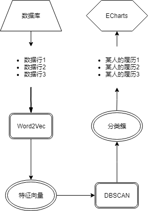

# 基本结构

# 特征向量

## 词向量的构造
### BOW
最开始我们试着按照传统的BOW(bag of words，词袋法)来构造词向量。我们将每个关键词作为一维，若一篇论文的关键词中有该关键词，则该论文的词向量中对应的该维就为1，否则为0。但这种表示法会导致词向量的维数极多。我们所拥有的论文数据量大约为百万级，若每篇论文都有五个关键词，其中三个关键词是和其他论文重复的，那么我们的关键词数量也依然是百万级。这也就意味着词向量的维数将达到百万级，这对于缺乏专业计算设备的我们而言是无法实施的，也是无法推广出去、面对真实环境的。

### CBOW
为了避免过高的计算量，词向量的维数必须被降低。我们注意到关键词之间存在明显的关联性。例如“深度学习”和“神经网络”在语义上是有高度的关联度的。这也就意味着可以通过提取词与词之间的关联性，将这些不同种类的关联性作为词向量的各维，来实现词向量维数的降低。这种做法已经有很多人实践了，例如Latent Semantic Analysis (LSA)[1], Latent Dirichlet Allocation (LDA)[2]，还有基于神经网络实现的Feedforward Neural Net Language Model (NNLM)[3]。

综合考虑到计算性能与训练效果，我们选择在2015年由google提出的Continous Bag-of-Words (CBOW)模型[4]。神经网络实现的NNLM模型因为其隐藏层而导致计算复杂度过高，CBOW与其类似，但没有隐藏层，故而计算复杂度维持在了较低的水平上。

在[4]中，Mikolov et al.还提出了Skip-Gram模型。CBOW模型输入上下文单词的词向量，输出当前单词的词向量。Skip-Gram模型输入当前单词的词向量，输出最可能的上下文单词的词向量。CBOW显然更适合无序性的关键词的表示。我们将每篇论文的所有其他的关键词词向量作为训练目标关键词词向量的输入，这也同样是因为关键词的无序性。如果选择临近的若干个关键词作为输入的话，那么这相当于也将论文中关键词的排序考虑了进去，而事实上每个关键词的作用域应该是整篇论文。

### 训练参数的选择
有主要影响的参数有两个：
1. 最小计数。出现次数少于最小计数的词将被忽略。考虑到论文具有专业性、创新性，有许多论文具有唯一的、新颖的关键词，我们选择将最小计数设为1，即，不忽略任何词。
2. 词向量维数。维数与训练时间是成正相关的[4]。受限于计算能力的限制，为了在几个自然日内能完成运算，我们选择了一个较小的100作为维数。

## 特征向量的构造

如图[2]，我们使用CBOW作为词向量模型，每一个词都对应一个向量，该向量的每一维都表示某种含义。在[4]中，Mikolov简单地对向量进行加减就得到了词与词之间在语义上的潜在关系。我们参照他们的成功做法，也简单地将一篇论文中的所有关键词的词向量相加来作为这篇论文的特征向量。

# 参考文献
[1]: Susan T.Dumais. Latent semantic analysis, Annual Review of Information Science and Technology/Volume 38, Issue 1, 22 September 2005

[2]: Pritchard, J. K., Stephens, M., Donnelly, P. Inference of population structure using multilocus genotype data. Genetics. 155 (2): pp. 945–959, June 2000

[3]: Y. Bengio, R. Ducharme, P. Vincent. A neural probabilistic language model. Journal of Machine Learning Research, 3:1137-1155, 2003.

[4]: Mikolov, T., Chen K., Corrado G., & Dean J. Efficient Estimation of Word Representations in Vector Space, In Proceedings of Workshop at ICLR, 2013